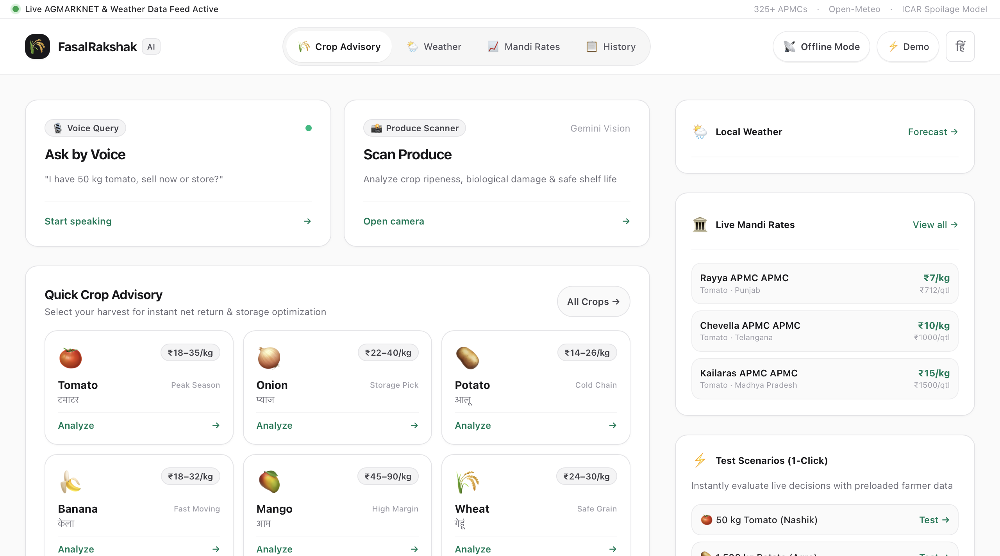
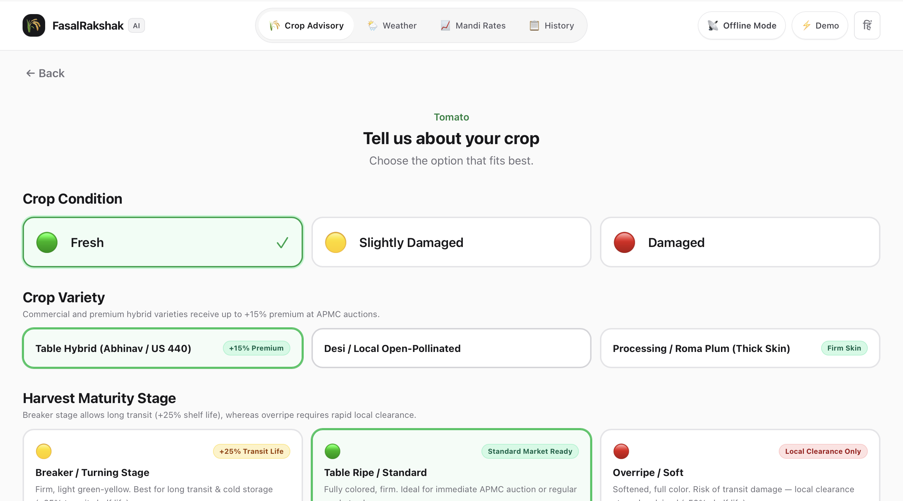
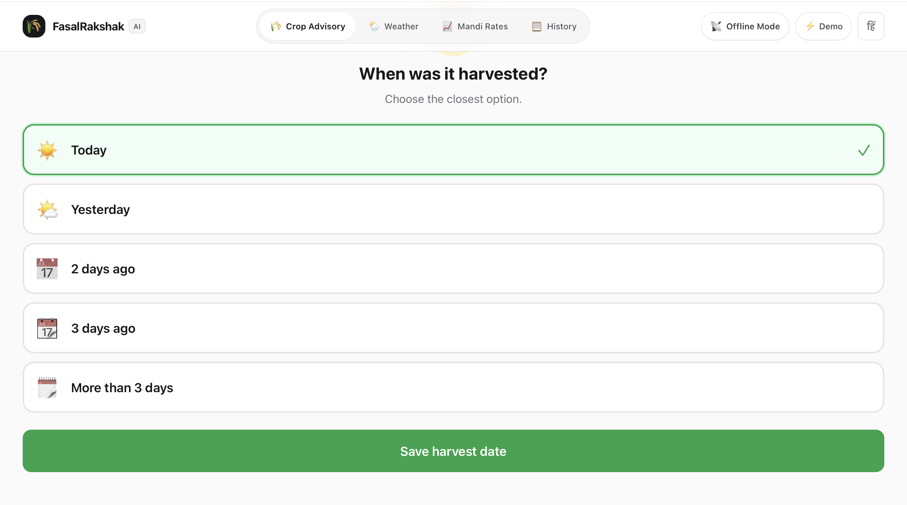
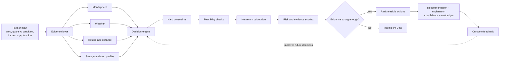
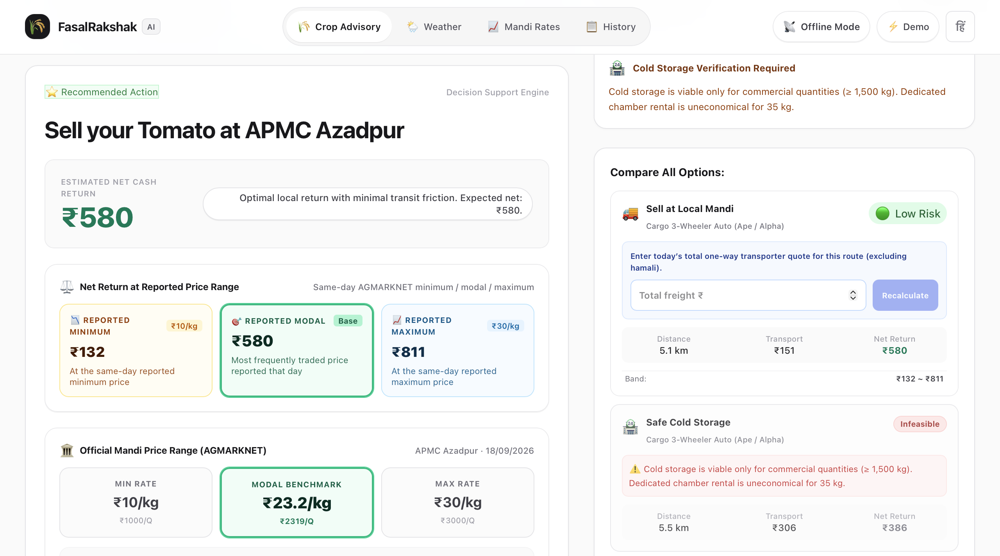
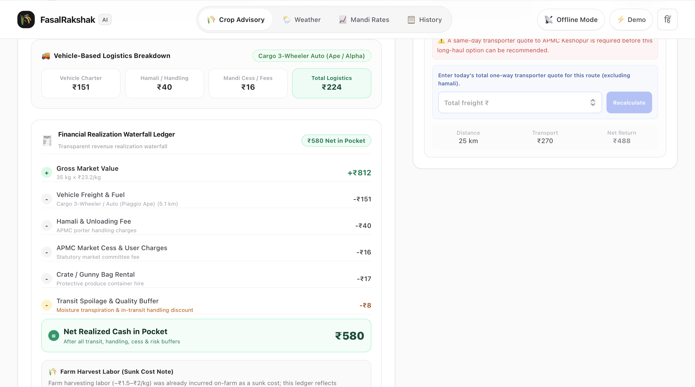
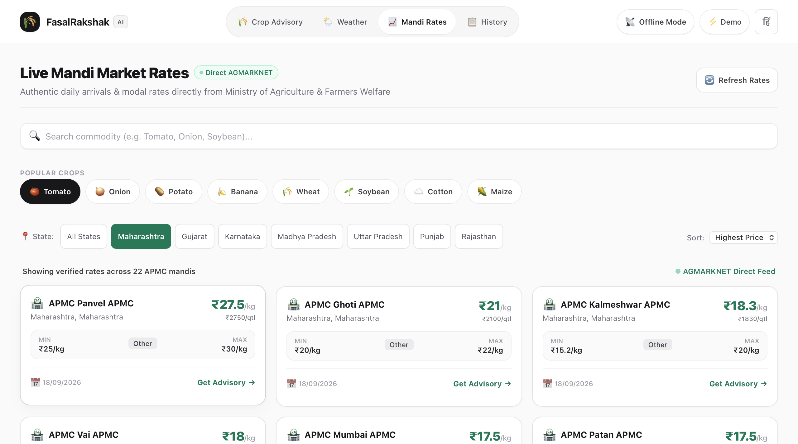
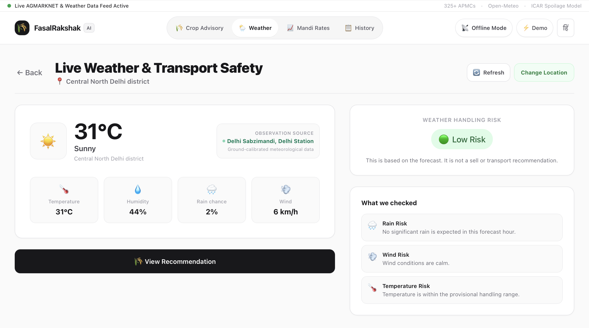
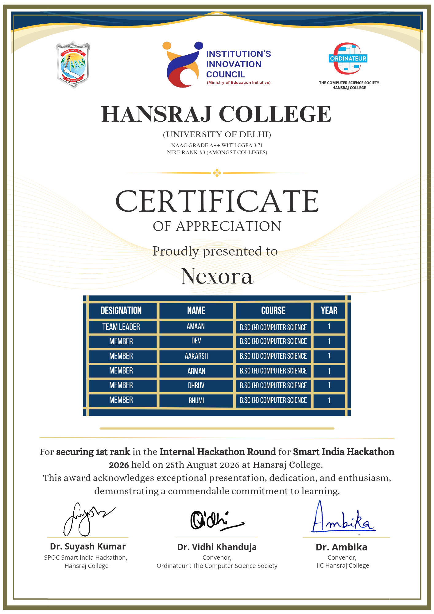

# FasalRakshak AI

<div align="center">

### Post-harvest decision intelligence for Indian farmers

**Built by Team Nexora for Smart India Hackathon 2026**

`SIH26132` &nbsp;•&nbsp; Agriculture, FoodTech & Rural Development &nbsp;•&nbsp; Software

**Data → Insights → Better Decisions → Stronger Farmers**

</div>

> [!IMPORTANT]
> **This is a public showcase repository.** The application source code is private at the collective request of the team members and is not included here. This repository documents the problem, product thinking, system design, prototype, research, and impact of the project.

## Contents

- [The decision after harvest matters](#the-decision-after-harvest-matters)
- [Why we built it](#why-we-built-it)
- [What the prototype does](#what-the-prototype-does)
- [How the decision engine works](#how-the-decision-engine-works)
- [A recommendation you can audit](#a-recommendation-you-can-audit)
- [System design](#system-design)
- [Safety and failure handling](#safety-and-failure-handling)
- [Expected impact](#expected-impact)
- [Project story](#project-story)
- [Repository and usage](#repository-and-usage)

---

## The decision after harvest matters

A farmer may know that another mandi is offering a higher price, but that does not automatically make it the better market. The extra revenue can disappear after transport, handling charges, mandi fees, quality loss, and spoilage risk. Storage has the same problem: it may look attractive until remaining shelf life, storage suitability, capacity, and rental cost are considered.

**FasalRakshak AI** is Team Nexora's post-harvest loss-prevention and decision-support engine. It brings these scattered factors together and answers one practical question:

> **Should I sell nearby, store the crop, or sell it in another market?**

The system does not chase the highest displayed price. It ranks only feasible actions by their estimated **net realised return**, explains the important costs and risks, and attaches a confidence level to the result. When the available evidence is too weak, it returns **Insufficient Data** instead of manufacturing certainty.

<p align="center">
  
</p>

---

## Why we built it

Post-harvest information exists, but it rarely exists in one place or in a form that directly supports a farmer's next action. Mandi prices, weather conditions, crop shelf life, storage suitability, travel distance, and logistics costs come from different sources. Comparing them manually—especially when produce is perishable and time is limited—is difficult.

The scale of the problem is significant. The [NABCONS 2022 study published by the Ministry of Food Processing Industries](https://www.mofpi.gov.in/sites/default/files/phl_study_final_report_07.12.2022_2.pdf) estimates:

- **₹57,004 crore+** in annual post-harvest monetary loss across fruits and vegetables: ₹29,545 crore for fruits and ₹27,459 crore for vegetables.
- Post-harvest losses of **6.02–15.05% for fruits** and **4.87–11.61% for vegetables**, depending on the crop.

FasalRakshak AI addresses the gap between *having data* and *knowing what to do with it*.

---

## What the prototype does

| Capability | What it adds to the decision |
|---|---|
| **Guided crop assessment** | Captures crop, quantity, condition, variety, maturity, harvest age, and location without forcing the farmer to understand technical models. |
| **Live mandi comparison** | Compares minimum, maximum, and modal prices from AGMARKNET-backed market observations. |
| **Weather and handling risk** | Checks temperature, humidity, rain, and wind conditions that can affect transport and short-term handling. |
| **Route-aware logistics** | Estimates road distance and travel duration for nearby and distant markets. |
| **Storage feasibility** | Tests crop suitability, remaining shelf life, quantity, travel time, and storage constraints before treating storage as a valid option. |
| **Net-return calculation** | Works from expected sale value down to cash in hand after freight, handling, mandi charges, packaging, and spoilage buffers. |
| **Explainable recommendation** | Shows the selected action, competing options, reported price range, cost ledger, risk level, and confidence—not only a final label. |
| **Accessible interaction** | Supports Hindi/English presentation, voice-assisted input, crop-image recognition, offline-oriented PWA behaviour, and simple tap-based choices. |

<table>
  <tr>
    <td width="50%"></td>
    <td width="50%"></td>
  </tr>
  <tr>
    <td align="center"><b>1. Describe the crop</b></td>
    <td align="center"><b>2. Record harvest age</b></td>
  </tr>
</table>

---

## How the decision engine works



### 1. Hard constraints

The engine first rejects actions that should not be recommended at all. Examples include storing produce beyond its safe shelf life, proposing long travel for an overripe crop, or treating cold storage as economical for an unsuitable quantity.

### 2. Feasibility checks

The remaining actions are checked against crop condition, maturity, time since harvest, route duration, weather exposure, storage compatibility, and operational requirements. This ordering is intentional: an unsafe option should not win merely because its theoretical price is high.

### 3. Net realised return

For each feasible action, the engine estimates what is left after the real costs of completing it:

```text
Gross market value
− vehicle freight and fuel
− loading, unloading and handling
− mandi cess and user charges
− crates, bags or packaging
− storage cost, where applicable
− expected spoilage and quality-loss buffer
= estimated net realised return
```

The displayed market price remains a range—not a promise. Minimum, modal, and maximum reported prices are kept visible so the farmer can see how the outcome changes across actual market observations.

### 4. Risk, evidence, and confidence

The system considers freshness, source quality, missing fields, fallback use, and uncertainty. Stronger, newer evidence produces higher confidence. Stale or incomplete evidence lowers confidence; below the safe threshold, the correct output is **Insufficient Data**.

### 5. Action ranking

Only after these checks does the engine compare:

1. **Sell at a nearby mandi**
2. **Use suitable storage and sell later**
3. **Travel to a higher-value market**

The leading feasible option is returned with its expected return, range, risk, important caveats, and a comparison against the alternatives.

---

## A recommendation you can audit

The result screen is designed to answer four questions clearly:

- **What should I do?** A direct action such as “Sell at APMC Azadpur.”
- **Why this action?** The option offers the strongest feasible net return under the available evidence.
- **What might change the answer?** Price movement, a verified freight quote, storage availability, weather, or crop deterioration.
- **Where did the money go?** A line-by-line ledger explains the path from gross value to estimated cash in hand.

<p align="center">
  
</p>

<p align="center">
  
</p>

The prototype also separates **planning estimates** from **operationally verified values**. For example, a long-haul option can require a same-day transporter quote before it becomes recommendable, and a storage option can be marked infeasible when the quantity does not justify a dedicated cold-storage chamber.

---

## Live evidence, not isolated numbers

### Mandi prices

The market view lets the user search by commodity, filter by state, compare APMCs, and inspect daily minimum, maximum, and modal prices. These observations come from the Government of India's [AGMARKNET-derived daily mandi dataset](https://www.data.gov.in/catalog/current-daily-price-various-commodities-various-markets-mandi).

<p align="center">
  
</p>

### Weather and transport safety

Weather is treated as decision evidence, not decoration. The prototype translates local temperature, humidity, rain probability, and wind into a handling-risk assessment while clearly stating that weather alone is not a sell or transport recommendation.

<p align="center">
  
</p>

---

## System design

| Layer | Technology / responsibility |
|---|---|
| **Frontend** | React, TypeScript, Vite, Tailwind CSS |
| **Backend** | Node.js, Express, TypeScript |
| **Decision layer** | Rule-based feasibility, evidence, economics, risk, and confidence engine |
| **AI-assisted input** | Gemini Vision for produce-image analysis; voice-assisted crop input |
| **Market data** | AGMARKNET / data.gov.in daily mandi observations |
| **Weather** | Open-Meteo location-based forecast data |
| **Routing** | OSRM road distance and duration; Haversine distance as a controlled fallback |
| **Crop knowledge** | Crop-specific post-harvest references from ICAR institutes including CIPHET, CPRI, DOGR, NRCB, CISH, NRCG, IIWBR, and NRRI |
| **Experience** | Hindi/English interface, progressive web app, offline support, voice and image entry |

The system is designed around public/government data and public services, so it does not require specialised farm hardware to produce a decision.

---

## Safety and failure handling

| Real-world risk | System safeguard | Result |
|---|---|---|
| Mandi observations are missing or stale | Check source and freshness before scoring | Lower confidence or **Insufficient Data** |
| The most profitable option is unsafe for the crop | Compare remaining shelf life with storage and journey time | Remove the action before ranking |
| A route or storage estimate is not operationally verified | Keep estimates separate from live quotes and capacity checks | Ask for verification before dispatch |
| Routing service fails | Use a controlled Haversine fallback and mark weaker evidence | Continue cautiously with reduced confidence |
| Image or voice input is uncertain | Keep farmer confirmation in the flow | Avoid silently treating an AI guess as fact |
| External services are unavailable | Retain offline-oriented flows and cached/reference information where possible | Degrade gracefully instead of hiding the failure |

> **Core principle:** no recommendation is better than a confident-looking recommendation that the evidence cannot support.

---

## Why the approach is feasible

- **End-to-end prototype:** crop input, market data, weather, routing, storage checks, action ranking, and recommendation output are connected in a single journey.
- **Explainable by design:** a result can be followed through constraints → feasibility → economics → risk → confidence.
- **Deployable without new hardware:** the design works with public data sources and services already available on standard web-capable devices.
- **Built for imperfect conditions:** fallback distance calculation, offline-oriented access, explicit uncertainty, and human verification reflect real deployment constraints.
- **Economically grounded:** decisions are based on estimated money realised after costs, not the most attractive headline price.

---

## Expected impact

### Economic

- Helps identify when a higher mandi price is cancelled out by freight, fees, or spoilage.
- Makes storage a conditional economic choice rather than a default recommendation.
- Gives the farmer a comparable estimate of cash in hand across feasible actions.

### Social

- Reduces several scattered information sources to one understandable next step.
- Hindi/English, voice, image, and tap-based interaction lower the information barrier.
- Keeps reasoning visible so the farmer remains the final decision-maker.

### Environmental

- Avoids unnecessary long-distance movement when it does not improve the outcome.
- Supports better timing, routing, and use of existing market and storage infrastructure.
- Targets avoidable spoilage without encouraging unsafe storage.

---

## Data and research foundations

| Source | Role in the project |
|---|---|
| [AGMARKNET / data.gov.in](https://www.data.gov.in/catalog/current-daily-price-various-commodities-various-markets-mandi) | Daily wholesale minimum, maximum, and modal mandi-price observations |
| [Open-Meteo](https://open-meteo.com/en/docs) | Location-based forecast inputs for weather and handling risk |
| [OSRM](https://project-osrm.org/) | Road-route distance and duration estimates |
| [ICAR](https://icar.gov.in/) institutes | Crop-specific shelf-life, handling, storage, and post-harvest references |
| [MoFPI / NABCONS 2022](https://www.mofpi.gov.in/sites/default/files/phl_study_final_report_07.12.2022_2.pdf) | National study used to establish the scale of post-harvest loss |

Public data can be delayed, incomplete, or revised. FasalRakshak AI therefore treats each source as evidence with a quality level—not as unquestionable truth—and communicates uncertainty in the result.

---

## Prototype scope and limitations

This is a hackathon prototype and decision-support system, not a guarantee of sale price, crop quality, storage availability, or logistics service. Its estimates depend on the accuracy and freshness of the inputs and external data.

- Mandi prices are reported observations; the final auction price can differ.
- Transport and handling costs vary by vehicle, season, route, and local negotiation.
- Storage capacity and transporter availability must be confirmed before dispatch.
- Crop-image analysis assists input; it does not replace an expert quality inspection.
- Shelf-life references are decision aids and must be adapted to crop variety and local handling conditions.
- The farmer or operator remains responsible for verifying the final transaction.

---

## Project story

FasalRakshak AI was built by **Team Nexora**, a six-member first-year B.Sc. (Hons.) Computer Science team from Hansraj College, University of Delhi, for the college's internal round of **Smart India Hackathon 2026**.

The project addresses **“Strengthening market linkages and price discovery for farmers”** under Problem Statement **SIH26132**. Team Nexora secured **1st rank in the internal hackathon round** held on 25 August 2026 and advanced to official SIH registration under Team ID **128083**.

### Team Nexora

| Role | Member |
|---|---|
| Team Lead | [Mohd Amaan](https://github.com/mohdamaan0027) |
| Member | Dev |
| Member | Aakarsh |
| Member | Arman |
| Member | Dhruv |
| Member | Bhumi |

<details>
<summary><b>View the team recognition certificate</b></summary>
<br />
<p align="center">
  
</p>
</details>

---

## Repository and usage

This repository exists to present the project publicly while respecting the team's decision to keep its implementation private.

- It contains project documentation, interface screenshots, and recognition material.
- It does **not** contain the application source code, private configuration, API credentials, trained assets, or deployment files.
- The absence of source code is intentional and is not a missing setup step.
- No open-source licence is granted for the private implementation.

If you are reviewing the project for a hackathon, academic evaluation, or collaboration, the README is the canonical public overview. A guided prototype demonstration may be shared separately at the team's discretion.

---

<div align="center">

### Agriculture for People · Technology for Progress · Innovation for a Viksit Bharat

Built with care by **Team Nexora** 🌾

</div>
